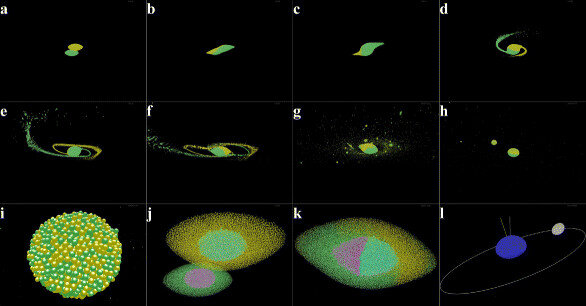
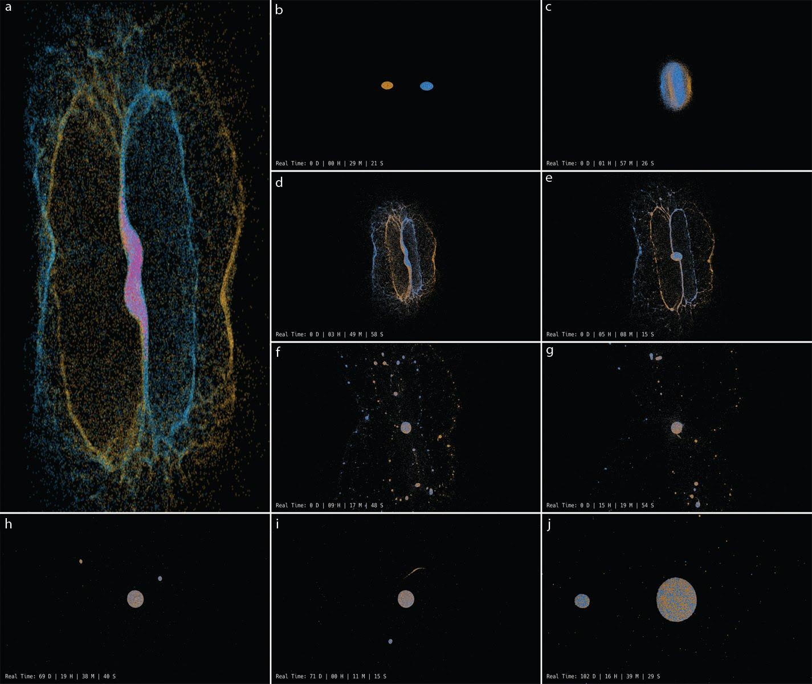

# Giant-Impact

There has been some interest in making our lunar forming impact code more user-friendly and accessible to other researchers. The original code was 5000 plus lines of code that just grew over the years making it just too convoluted to explain in a readme. Hence, we rewrote the code in hopes that it would be more user-friendly. But, if you would like to look at the old lunar-forming-impact code you can find it at the following link.

https://github.com/TSUParticleModelingGroup/lunar-forming-impacts

The new code is written for only one GPU but if there is interest we would consider extending it to work on multiple GPUs. Also if there are any questions, suggestions, or bugs you would like addressed please email them to me at wyatt@tarleton.edu. Please start the subject line with MoonCode so they will not get lost in the hundreds of emails I get each day.

## Brief background on the TSU Particle Modeling Group:

Most of our work is based on the N-body modeling work done by Donald Greenspan who wrote over 20 books on numerical analysis and computational modeling.

https://mathshistory.st-andrews.ac.uk/Biographies/Greenspan_Donald/

One of Dr. Greenspan’s core beliefs was to make models that worked and were as simple and understandable as possible. He based much of his work on the following quote from Richard Feynman. https://mathshistory.st-andrews.ac.uk/Biographies/Feynman/

“If, in some cataclysm, all of scientific knowledge were to be destroyed, and only one sentence passed on to the next generation of creatures, what statement would contain the most information in the fewest words? I believe it is the atomic hypothesis (or the atomic fact, or whatever you wish to call it) that all things are made of atoms — little particles that move around in perpetual motion, attracting each other when they are a little distance apart, but repelling upon being squeezed into one another. In that one sentence, you will see, there is an enormous amount of information about the world, if just a little imagination and thinking are applied.”

Dr. Greenspan did his work on Cray supercomputers.  Supercomputers priced out most small groups wanting to run large N-body problems. Jensen Huang and the NVIDIA corporation removed this price barrier in 2007 with the release of CUDA. CUDA is an API that allows developers to harness the power of NVIDIA GPUs. Due to Dr. Greenspan's passing in 2010 the TSU Particle Modeling Group felt driven to continue his work, but now accelerated on NVIDIA GPUs in place of Cray supercomputers.


## Background on our Giant Impact Hypothesis work:

The giant impact hypothesis proposed by Hartmann and Ward in 1975 is the dominant theory explaining the formation of our Moon. Our group did not like that researchers were using one model to simulate the creation of the lunar forming disk and then citing other models to say that the disk could coalesce into our Moon. Hence, we built a single model that created the proto-lunar disk and have it coalesce into a moon. This is the model we are presenting in this GitHub repository. Details about the inner workings of the model can be found in our paper: “Lunar-Forming Giant Impact Model Utilizing Modern Graphics Processing Units”
DOI: 10.1007/s12036-014-9306-9
<br />
<div align="center">
  <a>
    
  </a>
</div>

Next, we saw on the cover of Nature magazine that lunar forming impact models were being challenged because they were unable to simultaneously answer the isotopic and angular momentum constraints of the Earth-Moon system. We thought that the simplicity and versatility of our model would make it well-suited to tackle the proposed problem. This included searching through the large impact parameter space to find initial conditions that would produce an isotopically similar Earth and Moon with the proper angular momentum. We were able to do this rapidly, and along the way answered several other open questions about the Earth-Moon system. This is all explained in more detail in our paper: “Creating an Isotopically Similar Earth-Moon System with Correct Angular Momentum from a Giant Impact”
DOI: 10.1007/s12036-018-9515-8
<br />
<div align="center">
  <a>
    
  </a>
</div>

The code was written to find and analyze an Earth-Moon system if one arises from an impact between two bodies. But, the code can be used to study the impact between any two heavenly bodies. Just be aware that the analyzing functions will be going out and looking for an Earth and a Moon in the resultant debris of material.

## Requirements
* OS: Debian-based Linux distribution (Ubuntu tested)
* Hardware: An Nvidia GPU with semi-current drivers installed
* Software: The following dependencies are installed in the startMeUp script:
	* build-essential
 	* mesa-utils
  	* freeglut3-dev
   	* nvidia-cuda-toolkit
    * ffmpeg


## Instructions

After cloning the repository, open a terminal in this folder (Giant-Impact). 

Go to this new terminal and type:
```sh
chmod 777 startMeUp
```
Then type in this new terminal:
```sh
./startMeUp
```

### Target and Impactor
-----The following steps set up the Target and Impactor bodies.-----


1. To compile all the code and place it in the correct locations, in the terminal, type:

        ./compileAll 
   
   (Note this only needs to be done once unless you modify the source code.)

2. Now, you should open the setupGeneratingTargetImpactor file and set the parameters for your run. 
   These parameters will set the parameters for the two bodies that will be created.
   Once you are happy with your setup parameters, save the file.

3. Next, you will generate the Target and Impactor with the parameters you set in the 
   setupGeneratingTargetImpactor file. First, the bodies will be created and allowed to settle into place.
   Then, the bodies will be spun, and again, allowed to settle. At this point, the bodies are completely
   independent and have no influence on one another. Once this process has been completed, the Target and 
   The impactor will be put in a time-stamped folder in the TargetImpactorBin. 
   (Note the time stamp only goes down to the minute so if you make more than one
   in a minute the program will throw an error.) To generate the bodies, in the terminal type:
	```sh
	./runGTI
	```
   You should note the date/time to identify the bodies you just created.

5. Open the TargetImpactorBin folder, and you will find the generated folder containing the two bodies.
   If you would like, you can rename this folder to a more descriptive name. Go into this folder. In this
   folder you will find two folders and three files, containing all the information you will need to create
   impacts using the two bodies you created.

### Initial Conditions
-----The following steps set up the initial conditions for an impact.-----

   
1. Open the setupImpactInitialization file and set the parameters for the impact.
   Note, that this just sets the initial positions and velocities of the two bodies to be impacted.
   Don't forget to save the file.

2. Next you will generate an initial impact (ie, time = 0) with the specified positions and velocities.
   To do this, type this in the terminal:
```sh
./runImpactInitialization
```
   This will then create a time-stamped folder in the ImpactBin folder which contains 1 folder and 4 files. 
   (Note the time stamp only goes down to the minute so	if you make more than one in a minute the program will 
   throw an error.).
   If you would like, you can change the name of this folder to something more descriptive.	
	
3. Go into your new folder and follow the instructions outlined below. 

### Adding time and Viewing
-----The following steps are for adding time to an impact or viewing an impact.-----

1. Open a terminal in this folder. 
   A shortcut is to right-click and choose "Open in Terminal".

2. Open the setupImpactAddTime file and set the time to add to the impact. You can also modify
   parameters to change the time step, draw rate, and record rate. Don't forget to save the file.

3. To actually add time to the impact, in the terminal, type 
```sh
	./runImpactAddTime
```	
   Note: this will add additional time to the impact starting from where it left off.

4. At any time, to view the entire impact, in the terminal, type
```sh
	./runImpactViewer
```	
   Note: this viewer does no n-body calculations. It simply reads the impactPosVel file and displays
   frames to the screen.

### ImpactBin info
-----The following is information about the two folders in the ImpactBin directory-----

- The ImpactBin folder contains all impacts created for this setup of bodies.

- The TargetImpactorInformation folder contains 4 files:

  	The setupGeneratingTargetImpactor file is just a copy of the setup file in the Giant-Impact folder 
  	that created this set of bodies.
  
  	The targetImpactorInitialPosVel file (a binary file) contains the positions and velocities of the 
  	two bodies.
  
  	The targetImpactorParameters file contains unit conversion and other pertinent information about 
  	the two bodies.

  	The targetImpactorStats file contains general stats about the two bodies created.
### Impact Information and runStatsFile
-----The following is information about the impactInformation folder and runStatsFile file-----

- The runStatsFile file contains stats about the impact up to the current time. It is updated every time
  runImpactAddTime is called.

- The impactInformation folder contains 3 files:

  	The impactPosVel file (a binary file) contains the positions and velocities of all elements in the impact.
  	
  	The initialStatsFile file contains the initial (ie. time = 0) stats of the impact. 
  	
  	The setupImpactInitialization file contains a copy of the setup file that set up the initial conditions of
  	the impact.

## Acknowledements
Upkeep of this repository is managed by the Tarleton Particle Modeling Group.
Special thanks to the Tarleton HPC Lab for the use of its hardware.
This ReadMe was written by Gavin McIntosh and Zachary Watson.
